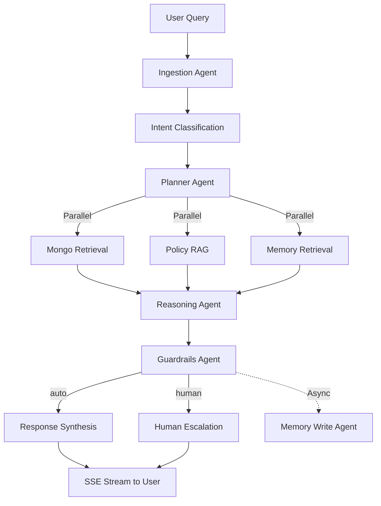

# Intelligent Support Co-Pilot - Agentic System

## Hackathon Criteria Mapping

### 3.1 RAG - Retrieval Before Generation
- **Where:** `app/agents/subgraphs/policy_rag_subgraph.py`, `mongo_retrieval_subgraph.py`, `memory_retrieval_subgraph.py`
- **How:** Planner activates retrieval agents → parallel evidence gathering → reasoning synthesizes
- **Separation:** Retrieval (subgraphs) → Reasoning (`reasoning_agent.py`) → Synthesis (`response_synthesis_agent.py`)

### 3.2 Chunking & Overlap
- **Where:** `app/services/chunking.py:chunk_text_custom()`
- **Strategy:** Word-boundary chunking, max_chars=2500, overlap=100
- **Justification:** Sentence > newline > word priority preserves semantic continuity; 100-char overlap prevents context loss at boundaries

### 3.3 Context Management
- **Windowing:** `app/services/memory.py` - Last 10 messages + summary
- **Summarization:** `app/services/summarization.py` - LLM-based every 10 messages
- **Prevents unbounded growth:** Summary replaces old messages as system message

### 3.4 Memory Types (Explicit)
- **Working:** `app/services/memory.py:build_working_memory()` - Per-turn assembly (summary + recent 10)
- **Episodic:** `app/utils/memory_builder.py:build_episodic_user_memory()` - User behavior patterns (user-scoped)
- **Semantic:** `app/utils/memory_builder.py:build_semantic_app_memory()` - Operational patterns (app-scoped)
- **Procedural:** `app/utils/memory_builder.py:build_procedural_app_memory()` - "What works" knowledge (app-scoped)
- **Read/Write:** Tools in `app/tools/mem0/` for retrieval, `app/agents/memory_write_agent.py` for writes

### 3.5 Memory Persistence
- **MongoDB:** Conversations, messages, summaries (`app/services/conversation.py`)
- **Mem0:** Episodic/semantic/procedural memories (`app/infra/mem0.py`)
- **Cross-request:** Working memory retrieves summary + Mem0 context on each turn

### 3.6 Guardrails & Safety
- **NeMo Guardrails:** `app/infra/guardrails.py` - PII, jailbreak, harmful content, hallucination detection
- **Confidence thresholds:** `app/agents/guardrails_agent.py` - Confidence gates for auto vs escalation
- **Escalation:** `app/agents/human_escalation_agent.py` - Creates handover packet when confidence < threshold
- **Safety agent:** Guardrails agent owns final routing decision

### 3.7 Planning & Delegation
- **Planner:** `app/agents/planner_agent.py` - LLM selects `agents_to_activate` from [mongo_retrieval, policy_rag, memory_retrieval]
- **Delegation:** `app/agent/graph.py:route_to_retrievals()` - Dispatches to parallel retrieval subgraphs
- **Agent boundaries:** Each agent in separate file (ingestion, intent, planner, reasoning, synthesis, guardrails, memory_write)

### 3.8 Tool & Function Usage
- **Registry:** `app/tools/registry.py` - MONGO_TOOLS, POLICY_TOOLS, MEMORY_TOOLS
- **LangChain BaseTool:** All tools inherit BaseTool with async `_arun()`
- **Observability:** `app/utils/tool_observability.py` - Emits tool_call_started/completed/failed
- **UI streaming:** `app/services/event_streamer.py` - Streams tool events to browser

### 3.9 Observability & Explainability
- **Langfuse:** `app/infra/langfuse_callback.py` - Automatic LLM tracing with domain metadata
- **Event streaming:** `app/services/event_streamer.py` - Streams thinking, evidence, hypotheses to UI
- **Tool tracking:** Each tool logs inputs/outputs/errors
- **Graph visibility:** SSE events show which agents ran, what data retrieved, reasoning steps

## 5. Execution Model

### Serial Execution
**Where:** `app/agent/graph.py` lines 95-97
**Flow:** Ingestion → Intent Classification → Planner (sequential dependencies)

### Parallel Execution
**Where:** `app/agent/graph.py:route_to_retrievals()` lines 23-43
**How:** LangGraph `Send()` dispatches to mongo_retrieval, policy_rag, memory_retrieval simultaneously
**Fan-in:** All converge to reasoning (waits for all)

### Asynchronous Execution
**Where:** `app/agents/memory_write_agent.py` line 164
**How:** `asyncio.create_task()` for fire-and-forget memory writes
**Non-blocking:** Memory writes don't delay response to user
**Also:** `app/api/chat.py` line 212 - async summarization trigger

## Architecture Diagram



## Tech Stack
- **Framework:** LangGraph (StateGraph with conditional edges, parallel nodes, subgraphs)
- **LLM:** OpenAI GPT-4o (expensive), GPT-4o-mini (cheap), text-embedding-3-small
- **Memory:** Mem0 (episodic/semantic/procedural), MongoDB (conversations/summaries)
- **RAG:** Elasticsearch (kNN vector search)
- **Guardrails:** NeMo Guardrails (PII/jailbreak/hallucination)
- **Observability:** Langfuse (LLM tracing), custom tool events
- **Testing:** Promptfoo (LLM evaluation), Pytest

## Setup & Run
```bash
# Install dependencies
pip install -r requirements.txt

# Set environment variables
cp env.template .env
# Fill in: OPENAI_API_KEY, MEM0_API_KEY, LANGFUSE_PUBLIC_KEY, etc.

# Seed MongoDB
python scripts/seed_mongodb.py --force --create-indexes

# Run server
uvicorn app.main:app --reload --port 8000

# Test query
curl -X POST http://localhost:8000/chat/stream \
  -H "Content-Type: application/json" \
  -d '{"user_id": "test", "message": "My order is late", "persona": "customer"}'
```

## Testing
- **Unit tests:** `pytest tests/`
- **LLM evaluation:** `promptfoo eval -c promptfoo/configs/planner.yaml`
- **Guardrails tests:** `pytest tests/test_guardrails.py`
